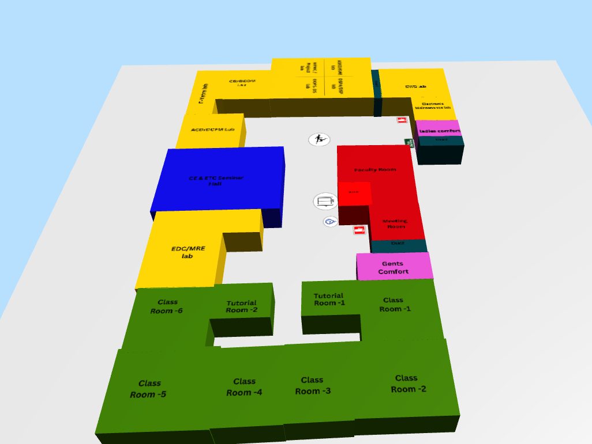
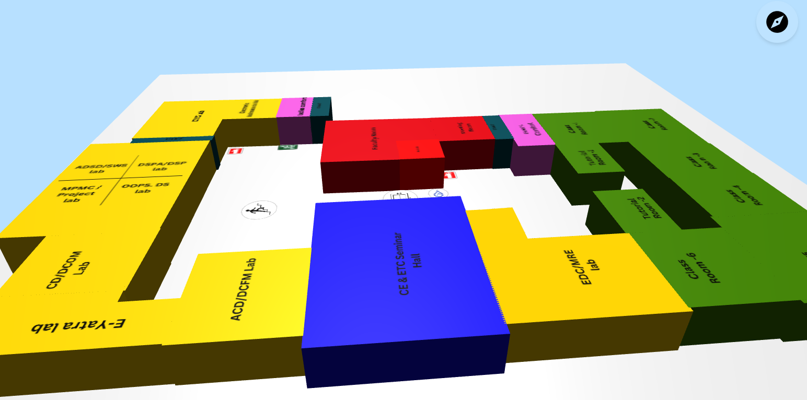

# Piyush-cha-Technex-25-Hack-a-Thon

## Project Overview
This repository is part of a hackathon submission. Below are some map images used in the project.

### Maps
#### Map 1


#### Map 2


#### Map 3


#### Map 4


## How to Run
1. Clone the repository:
   ```bash
   git clone https://github.com/piyush-cha/TECHNEX-25-HACK-A-THON-